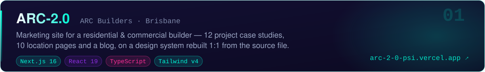
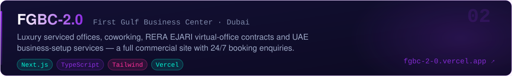
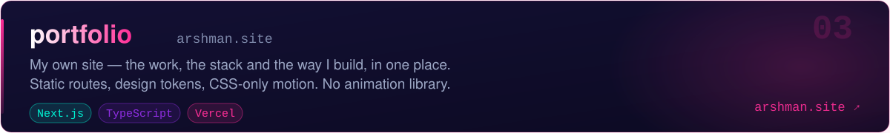

<!-- ═══════════════════════════ PROFILE README — Arshmanali577 ═══════════════════════════ -->

<div align="center">



<br/>


<br/>

<a href="https://arshman.site/">
  
</a>
<a href="https://www.linkedin.com/in/arshman-ali-814702386/">
  
</a>
<!-- 👇 swap in your real address and this becomes a live mail link -->
<a href="mailto:your.email@example.com">
  
</a>

<br/><br/>


<a href="https://github.com/Arshmanali577?tab=followers"></a>


</div>



<!-- ═══════════════════════════ WHOAMI ═══════════════════════════ -->
<h2 align="center">🧬 &nbsp;<samp>whoami</samp></h2>

```ts
const arshman = {
  role: "Full-Stack Developer",
  stack: ["TypeScript", "React", "Next.js", "Node.js"],
  building: ["ARC-2.0", "FGBC-2.0", "portfolio"],
  cares_about: ["static builds", "design tokens", "a11y", "Lighthouse 100s"],
  mindset: "ship fast, refactor smarter",
  funFact: "the last bug was never the last bug",
} as const;
```


<!-- ═══════════════════════════ TECH ARSENAL ═══════════════════════════ -->
<h2 align="center">⚙️ &nbsp;<samp>tech_arsenal</samp></h2>

<div align="center">

**💻 Languages**


**🎨 Frontend**


**🛠️ Backend &amp; Database**


**☁️ Tools &amp; Platforms**


</div>


<!-- ═══════════════════════════ FEATURED PROJECTS ═══════════════════════════ -->
<h2 align="center">🚀 &nbsp;<samp>featured_projects</samp></h2>

<div align="center">

<a href="https://github.com/Arshmanali577/ARC-2.0">
  
</a>
<a href="https://arc-2-0-psi.vercel.app"></a>


<br/><br/>

<a href="https://github.com/Arshmanali577/FGBC-2.0">
  
</a>
<a href="https://fgbc-2-0.vercel.app"></a>


<br/><br/>

<a href="https://github.com/Arshmanali577/portfolio">
  
</a>
<a href="https://arshman.site"></a>


</div>


<!-- ═══════════════════════════ HOW I BUILD ═══════════════════════════ -->
<h2 align="center">🧠 &nbsp;<samp>how_i_build</samp></h2>

- ⚡ **Static by default** — every route builds static, so a marketing page is a file on a CDN, not a render on request
- 🎨 **Design tokens in one place** — colour, type scale and breakpoints declared once, consumed as plain utilities everywhere else
- 📝 **Content-driven architecture** — no prose lives inside a component; copy sits in typed content files a non-developer can safely edit
- 🎬 **Motion without a library** — CSS-only scroll reveals and pointer effects, gated on `prefers-reduced-motion`, no animation dependency in the bundle
- 🔍 **SEO &amp; a11y baked in** — per-route metadata, sitemaps, JSON-LD schema, real focus states, sensible empty states
- 🧩 **Composition over one-offs** — a small set of layout idioms reused across pages beats a component per screen


<!-- ═══════════════════════════ ANALYTICS ═══════════════════════════ -->
<h2 align="center">📊 &nbsp;<samp>github_analytics</samp></h2>

<div align="center">


<br/><br/>

<!-- 🐍 generated by .github/workflows/snake.yml — runs every 12h and on push to main -->
<picture>
  <source media="(prefers-color-scheme: dark)" srcset="https://raw.githubusercontent.com/Arshmanali577/Arshmanali577/output/snake-dark.svg" />
  <source media="(prefers-color-scheme: light)" srcset="https://raw.githubusercontent.com/Arshmanali577/Arshmanali577/output/snake.svg" />
  
</picture>

</div>

<!--
  ╔══════════════════════════════════════════════════════════════════════════════════╗
  ║  OPTIONAL: stats card, top languages, pinned-repo cards and the trophy cabinet.  ║
  ║                                                                                  ║
  ║  These all come from github-readme-stats / github-profile-trophy, whose free      ║
  ║  public Vercel deployments are currently PAUSED (503 DEPLOYMENT_PAUSED), so the   ║
  ║  images render broken. The fix is to run your own copy — it takes about 3 min:    ║
  ║                                                                                  ║
  ║    1. Fork  https://github.com/anuraghazra/github-readme-stats                    ║
  ║    2. On vercel.com → Add New → Project → import your fork → Deploy               ║
  ║    3. Add an env var  PAT_1  = a GitHub personal access token (no scopes needed)  ║
  ║    4. Replace  github-readme-stats.vercel.app  below with your own Vercel domain  ║
  ║       and move this block out of the comment.                                    ║
  ╚══════════════════════════════════════════════════════════════════════════════════╝

<div align="center">


<br/><br/>


<br/><br/>


</div>
-->


<!-- ═══════════════════════════ CONNECT ═══════════════════════════ -->
<h2 align="center">💬 &nbsp;<samp>connect --with-me</samp></h2>

<div align="center">

<a href="https://www.linkedin.com/in/arshman-ali-814702386/">
  
</a>
&nbsp;
<a href="https://arshman.site/">
  
</a>
&nbsp;
<a href="mailto:your.email@example.com">
  
</a>

<br/><br/>

<i>⭐ From <a href="https://github.com/Arshmanali577">Arshmanali577</a> — thanks for stopping by</i>

<br/><br/>


</div>
